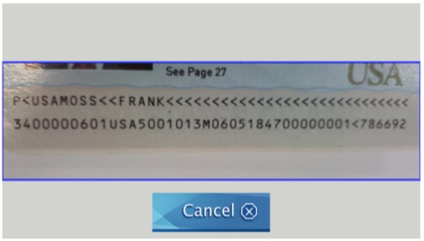
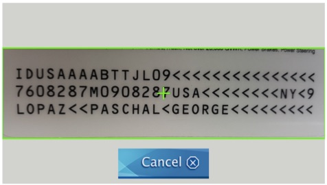

## WARNING: THIS IS A DEPRECATED VERSION. Please go to this [link](https://github.com/BlackSharkTech/xavier-demo-android) to get the latest version of the Android SDK.

The new version no longer require an evaluation license.  The unlicensed version will have a warning indicating that it is not license.

  
  

### Xavier Mrz SDK Android Integration Manual 
#### For Xavier Mrz Android SDK 1.2, October 2017   
#### By Blackshark Tech, Fairfax Station, VA 
**Description**  

The Xavier MRZ SDK contains a demo application that demonstrates the API calls you can use to interact with the Xavier Library. The Xavier MRZ SDK is an Android SDK that enables the developers to integrate the ability to perform OCR i.e. scan on International Civil Aviation Organization (ICAO) compliant two-line passport traveldocuments and three-line ID cards. Some sample documents that Xavier MRZ SDK can process are:
 

* Passport  
* Refugee Travel Document  
* Visa, Resident Alien, Commuter  
* Re-Entry Permit  

The Xavier MRZ SDK is capable of performing OCR on travel documents via the native camera to extract all the Machine Readable Zone (MRZ) fields from the travel documents. Xavier MRZ SDK performs auto capture when the quality threshold is reached or timeout occurred. The resulting  data are returned as key-value pair elements.

To integrate the Xavier MRZ SDK into your project, you need two Android libraries located in the app libs folder:  

* xavier-release.aar&nbsp;&nbsp;&nbsp;&nbsp;&nbsp;&nbsp;&nbsp;&nbsp;&nbsp;This is the Xavier library
* tess-two-release.aar&nbsp;&nbsp;&nbsp;&nbsp;&nbsp;This is the Google Leptonica library

The Xavier MRZ SDK is now capable of reading 1D and 2D barcodes. The resulting barcode is returned as a string similar to how MRZ results are returned. To facilitate this new feature, please add the following dependency to your app's gradle build file:

compile 'com.google.android.gms:play-services-vision:12.0.0'

The provided demo project was created using <b>Android Studio IDE version 1.2.2</b>. Please follow the instructions below on setting up and running the Xavier MRZ SDK demo application in Android Studio IDE. Android Studio IDE version 1.2.2 was used to develop the Xavier Evaluation SDK and the demo application. The project is configured to compile at Android API level 22 (Lollipop) andthe minimum Android API level is set to 14 (Ice Scream Sandwich).  

The Xavier Evaluation SDK has been successfully tested on both Lollipop and KitKat Android operating systems. The Xavier Evaluation SDK has been tested on the following Android phones  

* HTC One
* Samsung Galaxy (S4, S5, S6)
* Google Nexus 6.  

The Xavier Evaluation SDK will require a key and the email address registered to that key to operate.  Please contact BlackShark Tech at sales@blacksharktech.com to request an evaluation key.

You need to specify an email address to receive the generated key.  There is no obligation to purchase the Xavier MRZ SDK.  We invite you to explore and try it out for free.  

The Xavier Evaluation SDK displays a random pop-up screen to indicate that this is an evaluation version. Please contact BlackShark Tech email address sales@blacksharktech.com for a production license version of Xavier  

#### Getting the latest Xavier Evaluation SDK from GitHub  

1. On the right hand corner of the GitHub Xavier Evaluation SDK page, click the &quot;Clone In Desktop&quot; button to download the Xavier Evaluation SDK project. This is a self contained Xavier Evaluation project which has all the components for you to run the demo application on the Android phone. It also contains the two dependency libraries (xavier-release.aar and tess-two-release.aar).  
2. After the Xavier Evaluation SDK cloning is completed, open Android Studio IDE. Go to File menu and select Open and go to the cloned Xavier Evaluation SDK folder to open the Xavier Evaluation SDK project.
3. Copy the file Xavier.plist from folder "Setting file" to the folder app\src\main\res\raw\  
&nbsp;<i>NOTE:</i> For consistency with the iOS version and convienience, the Android app will now also require the file Xavier.plist to run properly. This file is a simple xml file that contains all external settings for Xavier.      

#### Running Xavier Evaluation SDK application on the Android phone  
1. Connect the Android phone to your laptop via the USB connection. 
2.  Before running the Xavier Evaluation SDK demo application from the Android Studio IDE, make sure the Android phone USB debugging option checkbox option in Settings is selected.   
   
3. Run Xavier Evaluation application from Android Studio IDE.  
4. Once Xavier Evaluation application is running on the Android phone. You should see the following screen:  
5. Click &quot;Start&quot; button to initiate the MRZ capturing process. The capturing screen should display as below:    

&nbsp;&nbsp;&nbsp;&nbsp;&nbsp;&nbsp;&nbsp;&nbsp;**For two-line MRZ Document  (Figure 1)**

&nbsp;&nbsp;&nbsp;&nbsp;&nbsp;&nbsp;&nbsp;&nbsp;   

&nbsp;&nbsp;&nbsp;&nbsp;&nbsp;&nbsp;&nbsp;&nbsp;**For three-line MRZ document (Figure 2)**

&nbsp;&nbsp;&nbsp;&nbsp;&nbsp;&nbsp;&nbsp;&nbsp;   
 
6. To capture MRZ data accurately, hold the document as close as possible to the camera and make sure the MRZ lines (either two-line or three-line document) fall within the rectangular box on the phonescreen.   
7. The capturing screen displays a rectangular box in blue color (Figure 1) when it is not detecting any MRZ lines. The rectangular box turns to green (Figure 2) with a plus mark when it detects the MRZ lines.   
8. The capturing screen automatically goes away under one of these three conditions:  
    1. When the MRZ lines are successfully captured.  Result code value is RESULT_OK.  
    2. When timeout has occurred and it returns the MRZ lines to the onActivityResult callback.  Timeout is currently set to 5 seconds. Result code value is RESULT_OK.  
    3. When an error occurred, it returns an error message in the onActivityResult callback. Result code value is RESULT_CANCELED.   
 
  
 
##### Xavier Library Integration Code 

##### 1. Starting up Xavier capturing screen 
Note: Please import xmlwise.Plist as well
<pre><code>
	Intentintent = new Intent(MainActivity.this, XavierActivity.class);    
	intent.setFlags(Intent.FLAG_ACTIVITY_SINGLE_TOP);    

	// Please email sales@blacksharktech.com to request for
	// an evaluation or production license key.
	// ----------------------------------------------------------------------
        HashMap<String, Object> properties = null;
        try {
            // Please refer to README for further instruction on how to create the raw xavier file
            InputStream inputStream =getResources().openRawResource(xavier);
            BufferedReader br = null;
            try {
                br = new BufferedReader(new InputStreamReader(inputStream));
                StringBuilder sb = new StringBuilder();
                String line;
                while ((line = br.readLine()) != null) {
                    sb.append(line);
                }
                properties = (HashMap<String, Object>) Plist.fromXml(sb.toString());
            } catch (Exception e) {
                e.printStackTrace();
            } finally {
                br.close();
            }
        } catch (Exception ex) {
            ex.printStackTrace();
        }
        
        intent.putExtra(XavierActivity.SETTINGS, properties);

	startActivityForResult(intent,MRZ_REQUEST)   
</code></pre>
##### 2. The MainActivity receives MRZ results in the onActivityResult callback.   
<pre><code>
protected void onActivityResult(int requestCode,int resultCode,Intent data{    
		super.onActivityResult(requestCode, resultCode,data);    
		if(requestCode == MRZ_REQUEST) {      
				if(resultCode == RESULT_OK) {     
					String mrzElements =(String)data.getSerializableExtra(XavierActivity.MRZ_LINES);    
					if(mrzElements == null||mrzElements.length()==0){    
						// No MRZ lines detected, request for another capture    
					} else {     
						// Successfully captured MRZ lines    
					}      
				}  
				else if(resultCode == RESULT_CANCELED) {  
						String errorMessage=(String)data.getSerializableExtra(XavierActivity.ERROR_MESSAGE);       
						if(errorMessage != null || !errorMessage.isEmpty()) {     
							// Log or display error message    
						}    
				}     
		}    		
} 
</code></pre>

#### Sample MRZ result data   
Here is the value of the mrzElements string which contains all the parsed MRZ elements in the onActivityResult method demo code when the MRZ capture is completed and onActivityResult callback is called:  
{documentType=P,   
subtype=&lt;,  
org=USA,   
name=MOSS&lt;&lt;FRANK&lt;&lt;&lt;&lt;&lt;&lt;&lt;&lt;&lt;&lt;&lt;&lt;&lt;&lt;&lt;&lt;&lt;&lt;&lt;&lt;&lt;&lt;&lt;&lt;&lt;&lt;&lt;&lt;,   
number=340000060,   
number_check=1,   
nationality=USA,  
birthdate=500101,  
birthdate_check=3,  
sex=M,  
expiration_date=060518,  
expiration_date_check=4,   
personal=700000001&lt;7866,   
personal_check=9,   
check=2}   

In our sample code, the mrzElements string result in the onActivityResult method is parsed and displayed on the Xavier Passport or ID result form.   

#### Handling unknown document type   
For demoing purposes, when the MRZ result (mrzElements string) is returned, the documentType key may have an invalid Document Type value due to an OCRing error.  The demo sample code has modules that salvage the unknown document type.  In this case, the Document Type is selected from the dropdown list. This code is demonstrated in the processMrzResult method of the MainActivity.   

#### Error Handling  
When an error occurrs, the errorMessage string in the onActivityResult callback method has the detailed description and stack trace of the error. The error message contains the following information:    

*  Stack trace
*  Error cause
*  Device: Brand, Device Name, Model, Id, and Product
*  Firmware: SDK, Release, and Incremental

#### Xavier.plist
Xavier.plist has been introduced as part of the Xavier SDK package. It must be added to any projects utilizing the Xavier library.

The plist contains the following fields: 
i. Email Address: The email one registers with BlackShark Tech to generate the license key 
ii. License Key: The license key obtained from BlackShark Tech to enable Xavier 
iii. previewing UIColor: Specify the color of the preview box for the Xavier widget. The value has to be a hex value for color 
iv. mrz detected UIColor: Specify the color of the preview box when the target MRZ is detected. The value has to be a hex value for color 
v. close button text: Specify the display text of the close button on the Xavier widget  
vi. Max Mrz Candidates: Specify the maximum number of MRZ candidates that the engine need to create the composite
vii. Max Ocr Timeout: Specify the maximum duration that the enginge will run

#### Additional Information  
Please feel free to contact us at info@blacksharktech.com for any questions.

##### Release Notes 
1.3 
* Continue to improve stability and accuracy
* Bug fixes 
1.2 
* Enhance performance
* Bug fixes 
1.1.0 
Add more properties for customization 
1.0.0     
Initial release of Xavier Evaluation SDK  
 
 
 
© 2017 BlackShark Tech All Rights Reserved.

